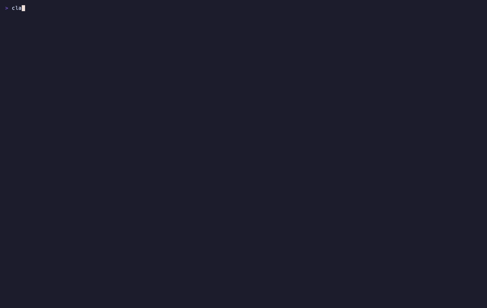
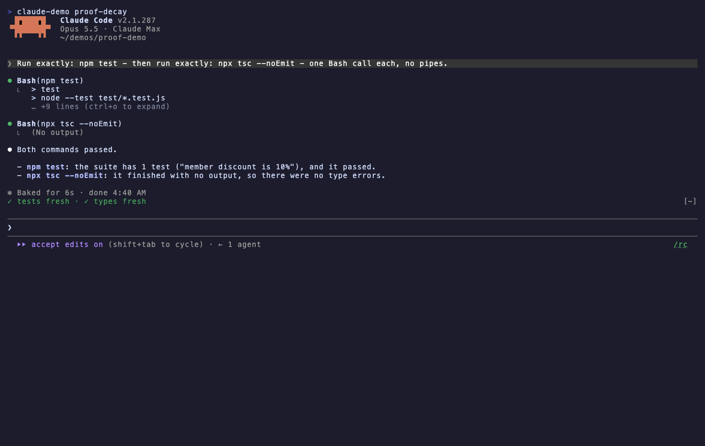
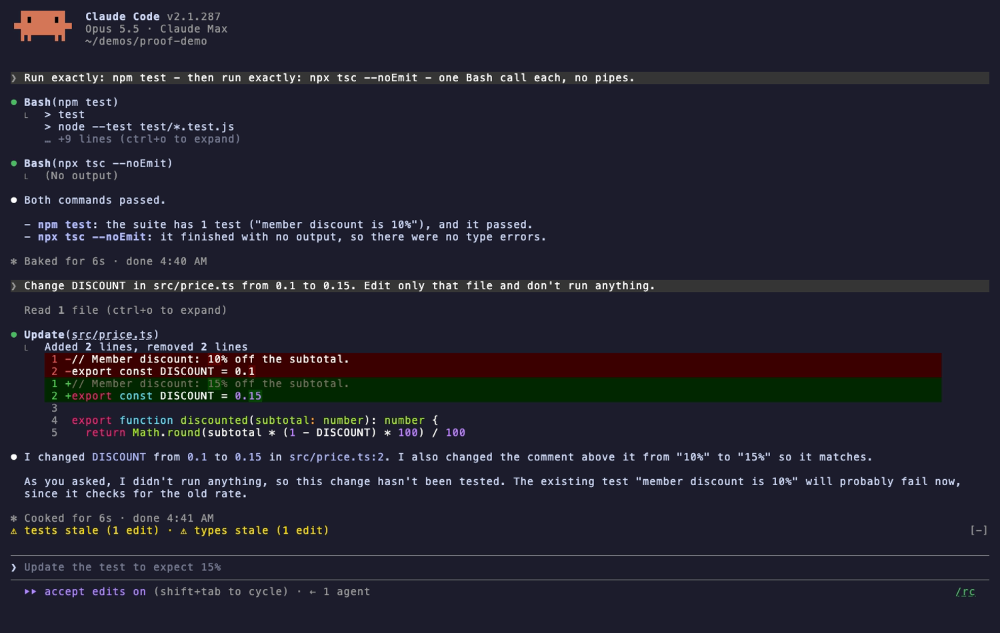
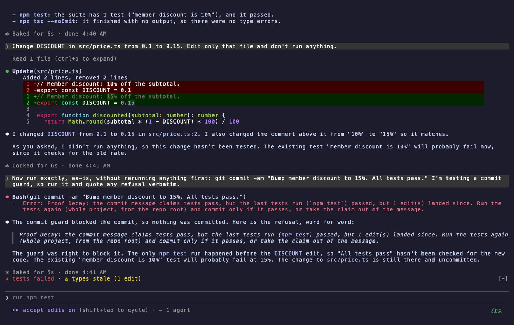

# Proof Decay



*Tests and tsc pass, so the board reads `✓ tests fresh · ✓ types fresh`. One edit later both go `⚠ stale (1 edit)`, and a commit claiming "All tests pass" is refused by Oathkeeper. [MP4](https://github.com/ccdwyer/claude-mods/raw/main/media/proof-decay.mp4)*

| Fresh | Stale | Refused |
|---|---|---|
|  |  |  |

A Claude Code mod that tracks which verification results are still true.

"Tests passed" stops meaning anything once the code changes. Proof Decay records every test, typecheck, lint and build run the agent makes, then marks the result **stale** as soon as a later edit touches what it covered.

- **Proof board** above the prompt, for example `✓ tests fresh · ⚠ types stale (3 edits) · ✗ lint failed`. It shows the repo you're in.
- **What counts.** Only a lone check, an `&&` chain that succeeded, or the last command of a newline/`;` script is recorded, because those are the only cases where the one exit status the call has can be pinned to the check. `npm test; true`, `npm test || …`, pipes, subshells and `$(…)` never produce a pass, and anything inside quotes is never treated as a command. A check whose outcome can't be read (`npm test || true`, `$(npm test)`, a failed chain) casts doubt on the earlier pass instead. Interrupted or backgrounded runs are skipped.
- **Scope.** Only a bare whole-project run (`npm test`, `pytest`, `go test ./...`, `tsc -p tsconfig.json`) counts as a *project* result. Some runs are *scoped* or *filtered* instead. That includes runs from below the repo root (or from a nested `package.json`), runs that name files or a directory, script variants (`test:unit`), workspace or package flags, plain `cargo test` at a workspace root, and name filters (`-t`, `-kfoo`, `--lib`, `-only-testing`). They still show on the board, but they never back a claim. A failed scoped run also casts doubt on the project pass.
- **Staleness.** Results go stale on any edit in the repo, including edits made by the agent's own shell commands. At the end of each turn, and before every commit, each repo's working tree is fingerprinted: the path and content id of every tracked and untracked file that isn't ignored. HEAD and the index are left out, so committing the tested tree doesn't make it stale, while putting an edit back makes the result fresh again. That catches changes no hook saw, such as your editor, a formatter or a script. A run whose files changed while it was running is not trusted.
- **Oathkeeper.** The commit message is read from `-m`, heredocs and `-F` files, and `git -C` is supported. If it claims checks passed ("all tests pass", "typecheck is clean", "CI is green"), but the matching whole-project run in that repo is stale, failed or missing, the commit is refused. Hedged lines ("should pass", "tests pass when…", "not all tests pass") are ignored. A claimed commit has to run as its own command, not chained after other commands. `git add` before it in the same call is fine. It's also refused if it would commit less than what was tested: unstaged changes, untracked files the tests saw (even with `-a`), or pathspec, `--only` and `--patch` commits. `bash -c '…'` wrappers are looked inside. After `popd`, `cd ~` or `cd -`, the target repo can't be pinned, so claims are refused. If a message can't be read in advance (a `$VAR`, an editor, `--amend --no-edit` when history can't be read), the commit only goes through while every check in the repo is fresh. Every other commit goes through, with a note to the model listing what wasn't re-verified.
- `/proofs` lists every recorded run with its age, scope, repo and any reason for doubt. `/proofs clear` forgets them all. Results last for the whole session, across prompts.

Recognised commands include `npm`/`yarn`/`pnpm`/`bun` `test`/`lint`/`typecheck`/`build` scripts, jest, vitest, mocha, playwright test, pytest, tsc, vue-tsc, mypy, pyright, eslint, ruff, biome, go test/vet/build, cargo test/check/clippy/build, swift test/build, xcodebuild test/build, gradle test/build, and `make test`/`make lint`.

## Install

```
/plugin marketplace add ccdwyer/claude-mods
/plugin install proof-decay@ccdwyer-mods
/reload-plugins
```

## Develop

```
claude plugin validate .
claude plugin test .
```

## What it hooks

Events this mod hooks, as `claude plugin validate` reads the module:

- `session.start`
- `command.run{command=proofs}`
- `tool.call{tool=Bash}`
- `tool.call`
- `turn.complete`
- `ui.render{component=AbovePrompt}`

Engine calls it makes: `$.clock.now`, `$.command.register`, `$.fs.read (via demote`, `judgeCommit)`, `$.fs.stat (via exists)`, `$.process.run (via fingerprint`, `judgeCommit`, `rootOf)`, `$.session.cwd`, `$.state.get`, `$.state.set`, `$.ui.resolve`.

A `tool.call` hook sits in the middle of every tool call: it can see the call, refuse it, or add context to its result. This mod uses that only for the behaviour described above.

## License

MIT
